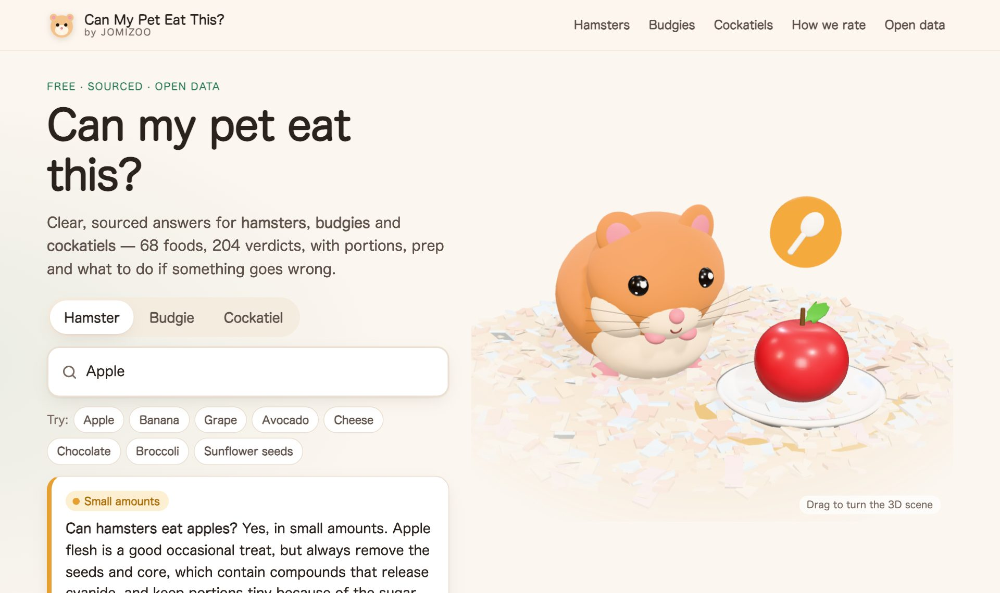

# Can My Pet Eat This? 🐹🦜

**Sourced, cautious food-safety answers for hamsters, budgies and cockatiels, with a 3D pet that reacts to every verdict.**

**Live site → https://limocax-pixel.github.io/can-my-pet-eat/**

[](https://github.com/limocax-pixel/can-my-pet-eat/actions/workflows/pages.yml)




Type a food, pick your pet, and get an answer you can act on:

- **68 foods × 3 species = 204 verdicts** on a four-level scale: **Yes** · **Small amounts** · **Better not** · **Never**
- A **portion** and **how often** for every food that's OK, and a stricter note for diabetes-prone **dwarf hamsters**
- **Preparation steps**, **risks** in plain language, and **what to do if your pet already ate it**
- **Every verdict is sourced** (VCA Animal Hospitals, Merck Veterinary Manual, avian-vet publications, RSPCA, PDSA, Blue Cross, peer-reviewed papers…) and labelled *direct* or *inferred*, with a confidence level
- **USDA nutrition data** per 100 g on every food page (sugar, fat, calcium : phosphorus…)
- An interactive **three.js scene**: the hamster, budgie or cockatiel hops happily, nibbles, tilts its head or turns away depending on the verdict. Every food is a procedural 3D model, with no downloaded assets.

## Why it exists

Small-pet owners get contradictory answers online, and many are written to sell something. We wanted one clear, cautious, **correctable** reference: when reputable sources disagree, we choose the safer rating, and we say so. See [the JOMIZOO Feeding Scale](https://limocax-pixel.github.io/can-my-pet-eat/feeding-scale/).

> Not veterinary advice. If your pet is unwell or ate something toxic, call an exotic-animal vet.

## Open data

Everything on the site is generated from [`data/`](data/). Use it in your app, research or article under **CC BY 4.0**:

| File | What |
| --- | --- |
| [`data/foods.json`](data/foods.json) | Foods, species and every verdict (status, short answer, portion, frequency, prep, benefits, risks, dwarf note, if-eaten, FAQ, sources, evidence, confidence) |
| [`data/sources.json`](data/sources.json) | The veterinary, charity and research sources cited |
| [`data/nutrition.json`](data/nutrition.json) | USDA FoodData Central values per 100 g (public domain) |
| [`/data/verdicts.csv`](https://limocax-pixel.github.io/can-my-pet-eat/data/verdicts.csv) | One row per food × species (built) |

Please credit: *Source: JOMIZOO, "Can My Pet Eat This?" (https://limocax-pixel.github.io/can-my-pet-eat/), CC BY 4.0.* GitHub's "Cite this repository" button uses [`CITATION.cff`](CITATION.cff).

For LLMs and AI search there is [`/llms.txt`](https://limocax-pixel.github.io/can-my-pet-eat/llms.txt) and a plain-text dump of every verdict at [`/llms-full.txt`](https://limocax-pixel.github.io/can-my-pet-eat/llms-full.txt).

## How it's built

A small static-site generator with no framework. Every page is pre-rendered HTML, so crawlers that don't run JavaScript still see the full answer. JavaScript only adds the finder and the 3D scene (three.js is lazy-loaded when the scene scrolls into view).

```
data/            foods.json, sources.json, species.json, nutrition.json, emergency.json
scripts/
  build.mjs      data + templates → dist/ (212 pages, sitemap, robots, llms.txt, JSON/CSV downloads)
  templates.mjs  HTML for every page type, with schema.org JSON-LD
  validate.mjs   data checks (run in CI)
  thumbs.mjs     renders food thumbnails, stage posters and social images with headless Chrome
  nutrition.mjs  extracts USDA SR Legacy values
src/
  main.js        finder, species switch, card tilt, lazy 3D
  3d/            three.js stage, procedural pets and 68 procedural food models
  styles.css
```

```bash
npm ci
npm run check    # validate data
npm run dev      # build + serve at http://localhost:4173/can-my-pet-eat/
npm run thumbs   # re-render images after changing models or verdicts (needs Google Chrome)
```

Pushing to `main` deploys to GitHub Pages via [`.github/workflows/pages.yml`](.github/workflows/pages.yml). To serve from a custom domain, build with `SITE_URL=https://your.domain npm run build`.

## Corrections and requests

Found a mistake? [Open a correction](https://github.com/limocax-pixel/can-my-pet-eat/issues/new?template=correction.yml) with a source. Veterinary professionals are especially welcome. Want another food rated? [Request it](https://github.com/limocax-pixel/can-my-pet-eat/issues/new?template=food-request.yml).

## About JOMIZOO

This project is made and maintained by [JOMIZOO](https://jomizoo.com/), a small-pet brand from Japan (paper bedding for hamsters and small animals, and carriers for hamsters and small birds). Our motto is *love & health for small pets*. The site has no ads and no affiliate links, and our products never influence a verdict.

## License

Code: [MIT](LICENSE). Data and text: [CC BY 4.0](data/LICENSE.md). Nutrient values: USDA FoodData Central (public domain).
